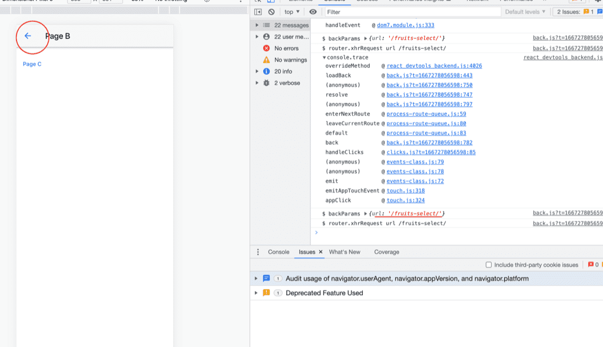

## This is for reproducing framework7 router related issue

## Problem

Back button in framework7 <Navbar backLink={'Back'} .../> React component unexpected sending XHR request to HTTP GET `/fruits-select` which adding by `smartselect`.

## Start

`cd vite-project`
`yarn dev`

## Screenshot



## Version
```
    "framework7": "5.7.11",
    "framework7-react": "5.7.11",
```
    
    